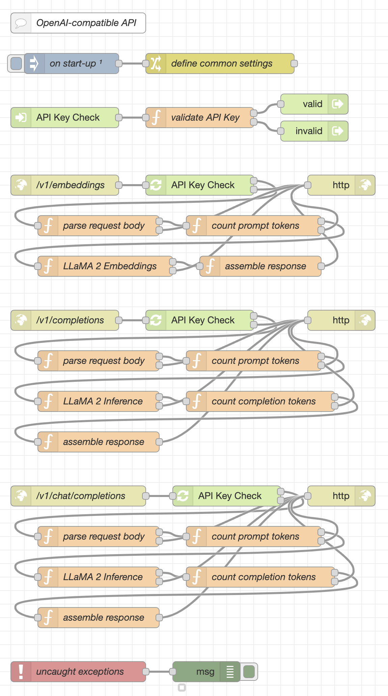

# node-red-flow-openai-api #

Node-RED Flows for OpenAI API compatible endpoints calling llama.cpp

This repository contains a few flows which implement a relevant subset of the OpenAI API in order to serve as a drop-in replacement for OpenAI in [LangChain](https://github.com/hwchase17/langchainjs) and similar tools.

So far, it has been tested both with low level tools (like `curl`) and [Flowise](https://github.com/rozek/Flowise), the no-code environment for LangChain - if you build the author's own version instead of the [original Flowise](https://github.com/FlowiseAI/Flowise), you will automatically get the nodes needed to access the Node-RED server.

The actual "heavy lifting" is done by [llama.cpp](https://github.com/rozek/llama.cpp) - please note, that you will need the author's version instead of the [original llama.cpp](https://github.com/ggerganov/llama.cpp) in order to get an additional tokenizer tool which is used to compute the statistics appended to OpenAI API responses.

Right now, the [13B variant of the LLaMA 2 LLM](https://huggingface.co/TheBloke/Llama-2-13B-GGML) has been hard-coded into the llama.cpp invocation and the parameter defaults were chosen with a view to achieving the best possible results.

## Installation ##

Start by creating a subfolder called `ai` within the installation folder of your Node-RED server. This subfolder will later store the llama.cpp executables and the actual model. Using such a subfolder helps keeping the folder structure of your server clean if you decide to play with other AI models as well.

### Building the Executable ###

Under the hood, the flows from this repository run native executables from [llama.cpp](https://github.com/rozek/llama.cpp). Simply follow the instructions found in section [Usage](https://github.com/rozek/llama.cpp#usage) of the llama.cpp docs to build these executables for your platform.

Afterwards, rename 

* `main` to `llama`,
* `tokenization` to `llama-tokens` and
* `embedding` to `llama-embeddings`

and copy these files only into the subfolder `ai` you created before.

### Preparing the Model ###

Just download the model from [HuggingFace](https://huggingface.co/TheBloke/Llama-2-13B-GGML/blob/main/llama-2-13b.ggmlv3.q4_0.bin) - it already has the proper format.

> Nota bene: right now, this model has been hard-coded into the flows - but this may easily be changed in the function sources

Afterwards, move the file `llama-2-13b.ggmlv3.q4_0.bin` into the same subfolder `ai` where you already placed the llama.cpp executables.

### Importing the Nodes ###

Finally, open the Flow Editor of your Node-RED server and import the contents of [OpenAI-API-flow.json](./OpenAI-API-flow.json). After deploying your changes, you are ready to use the implemented endpoints.

## Configuration ##

## Usage ##

The flows in this repository implement a small, but relevant subset of the OpenAI API - just enough to support LangChain and similar tools to run inferences on local hardware rather than somewhere in the cloud.

The set of supported request properties is an intersection of those [specified bei OpenAI](https://platform.openai.com/docs/api-reference) and those [accepted by llama.cpp](https://github.com/rozek/llama.cpp/blob/master/examples/main/README.md)

### /v1/embeddings ###

modelled after the OpenAI endpoint to [create an embedding vector](https://platform.openai.com/docs/api-reference/embeddings)

### /v1/completions ###

modelled after the OpenAI endpoint to [create a completion](https://platform.openai.com/docs/api-reference/completions)

### /v1/chat/completion ###

modelled after the OpenAI endpoint to [create a chat completion](https://platform.openai.com/docs/api-reference/chat)

## License ##

[MIT License](LICENSE.md)
